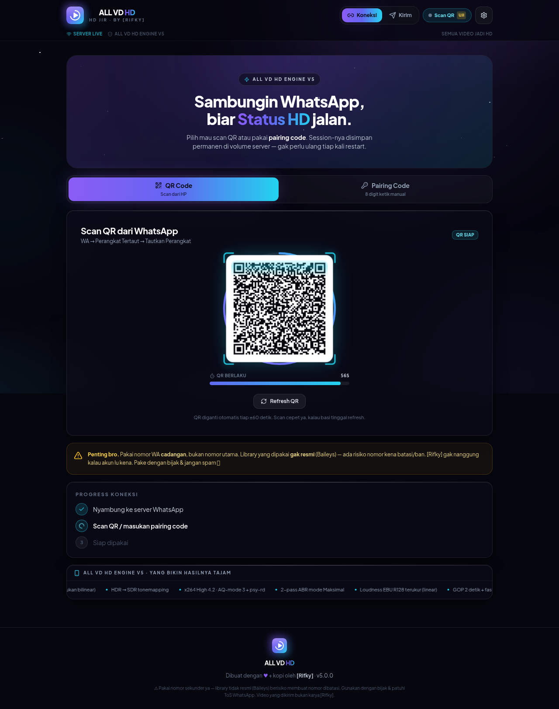
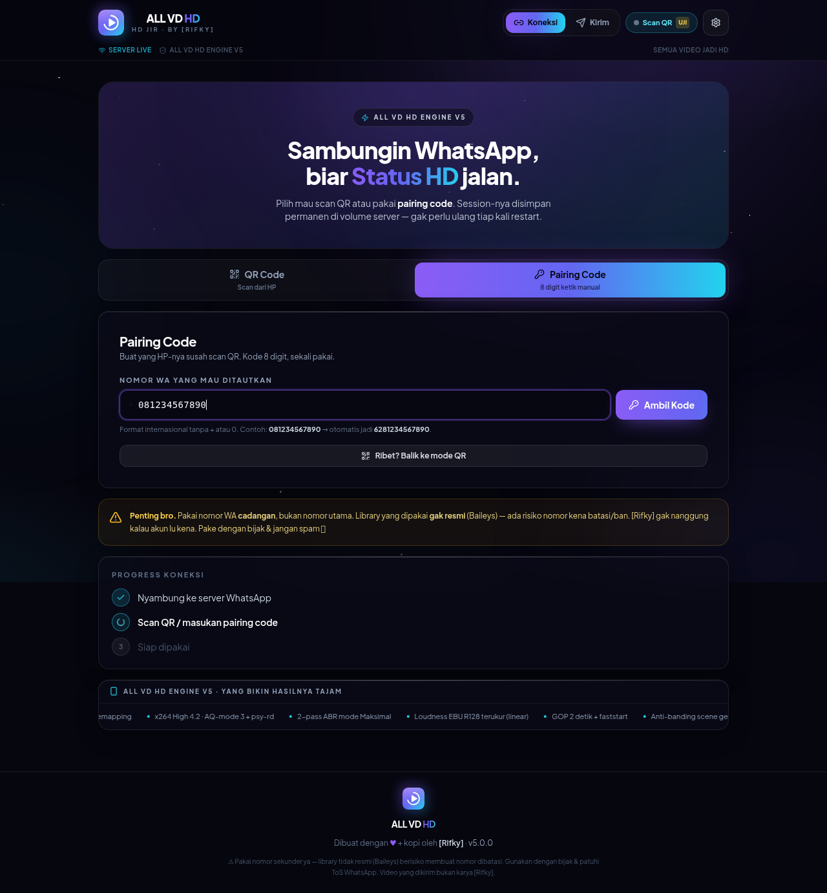
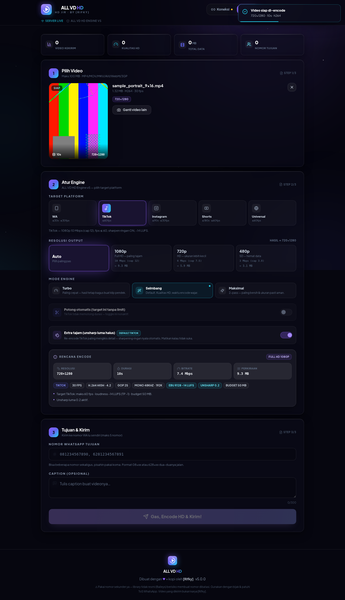
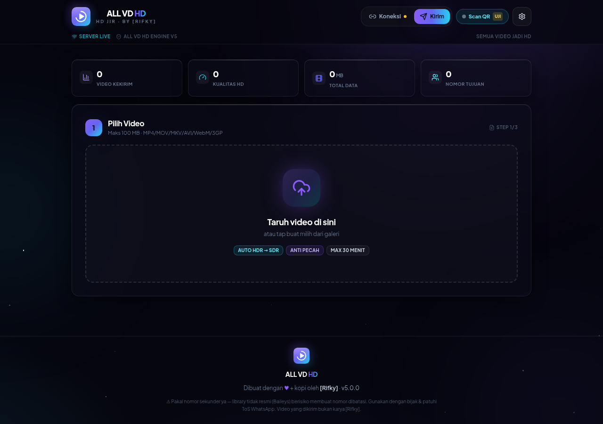
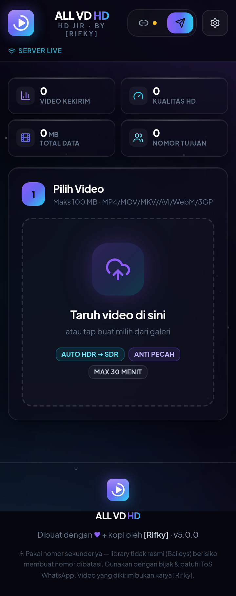

# ⚡ ALL VD HD — Semua Video Jadi HD

**v5.0.0 · "HD Jir" · by [Rifky]**

Web app buat upload & kirim video **HD anti pecah** — ke nomor WhatsApp kamu sendiri
(tinggal *tahan → Teruskan → Status*), atau di-encode sesuai spec **TikTok / IG Reels-Story /
YT Shorts** lalu diunduh buat diposting. Kualitasnya jauh lebih tajam dibanding upload
langsung dari galeri, karena video di-encode dulu oleh **ALL VD HD Engine v5** dengan
parameter yang mengikuti rekomendasi resmi tiap platform.

> **Kenapa lebih tajam?** Waktu upload dari galeri, platform meng-encode ulang videonya dan
> kualitas langsung anjlok (makanya pecah-pecah/blur). Di sini video dikirim/disimpan sebagai
> file yang **sudah di-encode optimal** — begitu di-re-encode platform, detailnya masih bertahan.

---

## 🆕 Yang Baru di v5

| Upgrade | Detail |
|---|---|
| 🎨 **Rebrand total** | Brand **ALL VD HD** (slug **HD Jir**), credit **[Rifky]**. Logo, favicon, ikon PWA 192/512/1024 + maskable, splash, manifest, dan OG image dibuat **dari nol** lewat `tools/make-icons.js`. Semua jejak brand lama dihapus. |
| 🌌 **Design system baru** | Dark premium ala app Play Store: gradien **violet→cyan**, glassmorphism, **Plus Jakarta Sans**, micro-interaction, mobile-first 360px, UI bahasa Indonesia. |
| 🎯 **Target Platform** | Pilihan **WA Status · TikTok · IG Reels/Story · YT Shorts · Universal** — tiap target punya ladder bitrate, cap fps, auto-trim, target loudness & default sharpening sendiri. Preview rencana encode via `POST /api/plan`. |
| 🔊 **Loudness EBU R128 akurat** | Pengukuran 2-langkah (`print_format=json` → apply `linear=true`): **-14 LUFS / TP -1.0** (TikTok/IG/Shorts) & **-16 LUFS / TP -1.5** (WA/Universal). Audio **AAC 48 kHz 192 kbps**. |
| 📥 **Mode Unduh (v5.0.1)** | Target selain WA Status (TikTok/IG/Shorts/Universal) **gak butuh nomor & gak kirim WA**: encode jalan → tombol **Unduh Video HD** muncul begitu selesai. Nomor tetap opsional kalau mau sekalian kirim ke WA. |
| 🔑 **Pairing code disempurnakan** | Kode **8 karakter Crockford uppercase** (persis case asli — key pairing case-sensitive), TTL countdown, endpoint `/api/connect/pairing` + `/refresh` + `/cancel`, auto-restart stream error 515 tanpa hapus session, pembersihan session rusak. |
| 🎬 **Engine v5** | H.264 **High 4.2** (≤1080p) · yuv420p · BT.709 · HDR→SDR tonemap (fallback anggun) · LANCZOS dimensi genap tanpa upscale · CFR via filter · GOP 2 detik · bframes 3 · aq-mode 3 · psy-rd 1.0:0.15 · trellis 2 · rc-lookahead 40–60 · unsharp luma ringan **default ON** untuk TikTok/IG · 3 mode Turbo/Seimbang/Maksimal (2-pass). |
| 📦 **Deploy** | Dockerfile **multi-stage** `node:20-slim` + ffmpeg sistem, semua data di `DATA_DIR` (volume `/data` di Railway), `/api/health` cepat, `railway.json` healthcheck, `.gitignore` aman (session & node_modules tidak masuk git). |

---

## 🎯 Target platform & spec encode

| Target | Resolusi | Bitrate video | Cap fps | Auto-trim | Loudness | Sharpen default |
|---|---|---|---|---|---|---|
| **WA Status** | ladder lama: 1080p cap 8 / 720p cap 5 / 480p 2.8 / 360p 1.8 Mbps | CRF+VBV / 2-pass | ≤30 | **30 dtk** · budget **16 MB** | -16 LUFS / TP -1.5 | mati |
| **TikTok** | 1080p = **10 Mbps** (cap 12) · 720p = 6 Mbps | 2-pass = 10/6 Mbps | ≤60 | tanpa batas | -14 LUFS / TP -1.0 | **ON (0.2)** |
| **IG Reels/Story** | 1080x1920 = **8 Mbps** (cap 10) | 2-pass = 8 Mbps | ≤30 | **90 dtk** (Reels) | -14 LUFS / TP -1.0 | **ON (0.18)** |
| **YT Shorts** | 1080p = **12 Mbps** | 2-pass = 12 Mbps | ≤60 | **180 dtk** | -14 LUFS / TP -1.0 | mati |
| **Universal** | 1080p = 10 Mbps (cap 12) | 2-pass = 10 Mbps | ≤60 | tanpa batas | -16 LUFS / TP -1.5 | mati |

**Anti-pecah ekstra (v5.0.2):** mode **Maksimal** = 2-pass di *cap* platform (TikTok 12 /
IG 10 / Shorts 15 Mbps) + unsharp sedikit lebih kuat — sumber paling "kaya" yang bisa kita
beri, supaya re-encode platform masih menyisakan detail. Ingat: TikTok/IG **selalu**
re-encode uploadannya (gak bisa dimatikan dari sisi uploader); karena itu aplikasi juga
menyediakan setelan **"Kualitas upload tinggi / Allow high-quality uploads"** — aktifkan,
dan kalau bisa upload lewat **web/desktop** (aplikasi HP sering mengompres lebih agresif).

Semua target: MP4 `+faststart` · H.264 **High** profile · level **4.2** untuk ≤1080p (naik
otomatis ke 5.x untuk frame lebih besar, mis. 4K — batas fisik standar) · `yuv420p` · tag
**BT.709** · HDR/10-bit di-tonemap ke SDR · scaling **LANCZOS** dimensi genap **tanpa upscale** ·
fps dinormalisasi lewat filter (CFR) · **GOP 2 detik** · `bframes=3` · `aq-mode=3` ·
`psy-rd=1.0:0.15` · `trellis=2` · `rc-lookahead` 40–60 (20 di mode hemat/LOW_MEM) ·
audio **AAC 48 kHz 192 kbps**.

> Catatan level: spec minta High 4.2 — dipakai untuk semua output ≤1080p. Untuk 1440p/4K,
> macroblock per frame melewati batas level 4.2 (8.704 MBs), jadi engine otomatis naik ke
> 5.0/5.1 (dan kalau x264 build lama menolak kombinasi level+DPB, retry ladder turun ke
> `level=auto`). Ini perilaku yang benar secara standar, bukan pelanggaran spec.

---

## 🔑 Pairing Code: cara kerjanya di v5

| # | Masalah klasik | Penanganan di v5 |
|---|---|---|
| 1 | `requestPairingCode()` ditembak **sebelum** WebSocket ke WA open → `Connection Closed` | Tunggu `waitForSocketOpen()` **dan** handshake `pair-device` (QR pertama dari server) baru minta kode |
| 2 | Event QR tiap ±20s menghapus kode yang lagi tampil di UI | Flag `pairingMode`: QR di-suppress selama pairing; kode cuma dihapus eksplisit |
| 3 | Listener `sock.ev.on('pairing.code')` — event yang **tidak ada** di Baileys (dead code) | Dihapus total; UI pakai event socket.io `pairing:code` yang benar-benar dikirim |
| 4 | Setelah kode dipakai di HP, WA kirim stream error **515 (restart required)** → stuck | 515 → auto-restart socket 1.2s **tanpa menghapus session**, login lanjut otomatis |
| 5 | Session rusak / setengah jadi (`creds.registered === false`) → kode ditolak (409/428) | Deteksi + bersihkan session mati sebelum pairing |
| 6 | Nomor `0812…` / `+62…` / `812…` / pakai spasi | Normalisasi otomatis → `62812…` + validasi pesan jelas |
| 7 | Kode kedaluwarsa diam-diam (±2 menit) | TTL countdown visual + badge + `/api/connect/pairing/refresh` |
| 8 | Gak ada jalan keluar saat pairing ribet | `/api/connect/pairing/cancel` → balik ke QR |
| 9 | (v5.0.3) kode lowercase selalu DITOLAK HP dalam hitungan detik | Kode ditampilkan **persis case asli (UPPERCASE)** — key pairing diturunkan case-sensitive dari string itu; instruksi UI diperbarui |
| 10 | (v5.0.1) request gagal karena handshake QR sudah aktif duluan | Kode diminta **begitu socket open** (sesuai contoh resmi Baileys), single-flight, dan socket di-restart bersih bila handshake QR terlanjur aktif; retry otomatis sekali bila gagal karena koneksi |
| 11 | (v5.0.4) HP selalu menolak: "Gagal menautkan perangkat" walau kode benar & baru | Upgrade Baileys **6.7.24 → 7.0.0-rc14**: stanza pairing 6.x memakai format platform-id lama yang sudah tidak diterima server WA terkini (dibuang diam-diam) |

> ⚠️ **Yang tidak bisa diuji otomatis:** penerbitan pairing code asli butuh **HP fisik** dengan
> WhatsApp aktif (kode dikirim server WA ke flow "Tautkan dengan nomor telepon"). Di sandbox CI
> kita menguji semua logika di sekitarnya (urutan handshake, suppress QR, format kode, TTL,
> endpoint refresh/cancel, penanganan 515 lewat simulasi) — lihat `scripts/smoke.js`.

---

## 📸 Tampilan (v5)

| Koneksi + QR | Pairing Code | Atur Engine (target platform) |
|---|---|---|
|  |  |  |

| Halaman Kirim | Mobile 360px |
|---|---|
|  |  |

---

## 🚀 Menjalankan lokal

```bash
# prasyarat: Node ≥ 18, ffmpeg (opsional — kalau tidak ada, ffmpeg-static dipakai otomatis)
npm ci                 # install server + client (workspaces)
npm run icons          # (opsional) regenerate logo/ikon/OG/splash dari SVG sumber
npm run build          # build client (Vite) → client/dist
npm start              # server produksi: serve client/dist + API di :3000

# development (hot reload)
npm run dev            # server :3001 + vite :5173 (proxy /api & /socket.io)

# uji tanpa WhatsApp asli
MOCK_SEND=true npm run smoke
npm run bench          # benchmark engine (tabel SSIM/PSNR/VMAF)
```

Variabel lingkungan lengkap ada di [`.env.example`](.env.example).

---

## ☁️ Deploy ke Railway (langkah lengkap)

1. **Push repo ini ke GitHub** (ZIP ini siap push: tidak ada `node_modules/`, `data/`, session).
2. Di [railway.app](https://railway.app) → **New Project → Deploy from GitHub repo** → pilih repo.
3. Railway otomatis mendeteksi `railway.json` → build pakai **Dockerfile** (multi-stage) dan
   healthcheck `GET /api/health` (timeout 120s, restart on failure).
4. **Pasang Volume**: service → *Volumes* → **mount path `/data`**.
   ⚠️ Wajib: filesystem container Railway **ephemeral** — tanpa volume, session WhatsApp &
   riwayat hilang setiap redeploy. App otomatis memakai `RAILWAY_VOLUME_MOUNT_PATH`.
5. Di tab **Variables**, set minimal:
   ```
   DATA_DIR=/data
   MOCK_SEND=false
   FFMPEG_THREADS=2        # container kecil (0.5–1 GB RAM)
   LOW_MEM=auto            # auto-hemat kalau RAM ≤ 1200 MB
   APP_KEY=                # opsional: proteksi akses web
   ```
   `PORT` tidak perlu diset (Railway menyuntikkan; Dockerfile EXPOSE 3000 sebagai default).
6. **Deploy**. Setelah sehat, buka domain service → halaman Koneksi → scan QR **atau** pairing
   code (pakai nomor WA cadangan!). Session tersimpan di volume → survive redeploy.
7. (Opsional) Domain custom + `restartPolicyType: ON_FAILURE` sudah diatur di `railway.json`.

**Deploy manual (VPS/Docker):**

```bash
docker build -t allvdhd:5 .
docker run -d --name allvdhd -p 3000:3000 \
  -v allvdhd_data:/data \
  -e DATA_DIR=/data -e FFMPEG_THREADS=4 \
  allvdhd:5
```

---

## 🧪 Verifikasi & benchmark

* `npm ci && npm run build` — lulus (lihat *Bukti Verifikasi* di bawah / CHANGELOG-v5).
* `npm run smoke` — **45/45 lolos** (boot+branding, unit pairing, plan per target, `/api/plan`,
  encode nyata tiktok & ig, pipeline socket lengkap, resend, multi-target, **mode unduh tanpa nomor**).
* `npm run bench` — tabel per sampel: engine lama (v4) vs v5 per target, setelah simulasi
  re-encode platform, diukur **SSIM + PSNR + VMAF** vs sumber asli.
* Uji encode nyata sampel **portrait / 4K / HDR10** untuk target **TikTok & IG** + output
  `ffprobe` — ada di `docs/verification/`.

### Hasil benchmark (ringkasan)

Run `npm run bench` (ffmpeg-static 7.0.2, libvmaf tersedia, jendela VMAF 6s, 2 CPU).
Metrik diukur pada hasil **setelah simulasi re-encode platform** vs **sumber asli**.

**sample_1080p_12s.mp4** — 1920x1080 · 30fps

| engine | res | ukuran | SSIM | PSNR | VMAF | simulasi |
|---|---|---|---|---|---|---|
| v4 lama (engine lama) | 1920x1080 | 6.49 MB | 0.9961 / 0.9898 | 45.52 / 40.31 | 95.5 / 91.5 | WA-hd / WA-low |
| v5 wa | 1920x1080 | 7.52 MB | 0.9957 / 0.9894 | 45.28 / 40.22 | 95.4 / 91.4 | WA-hd / WA-low |
| v5 tiktok | 1920x1080 | 7.03 MB | 0.9954 | 45.55 | 92.7 | tiktok-feed |
| v5 ig | 1920x1080 | 6.96 MB | 0.9947 | 44.64 | 92.2 | ig-feed |

**sample_720p_40s.mp4** — 1280x720 · 30fps

| engine | res | ukuran | SSIM | PSNR | VMAF | simulasi |
|---|---|---|---|---|---|---|
| v4 lama (engine lama) | 1280x720 | 14.23 MB | 0.9945 / 0.9906 | 43.13 / 40.15 | 95.2 / 92.2 | WA-hd / WA-low |
| v5 wa | 1280x720 | 14.58 MB | 0.9944 / 0.9905 | 43.07 / 40.11 | **95.4** / 92.0 | WA-hd / WA-low |
| v5 tiktok | 1280x720 | 13.66 MB | 0.9942 | 43.39 | 92.1 | tiktok-feed |
| v5 ig | 1280x720 | 13.57 MB | 0.9933 | 42.43 | 91.6 | ig-feed |

**sample_portrait_9x16.mp4** — 720x1280 · 30fps

| engine | res | ukuran | SSIM | PSNR | VMAF | simulasi |
|---|---|---|---|---|---|---|
| v4 lama (engine lama) | 720x1280 | 3.32 MB | 0.9945 / 0.9836 | 43.17 / 37.93 | 94.7 / 90.7 | WA-hd / WA-low |
| v5 wa | 720x1280 | 3.59 MB | 0.9944 / 0.9833 | 43.03 / 37.88 | **94.9** / **91.1** | WA-hd / WA-low |
| v5 tiktok | 720x1280 | 3.42 MB | 0.9924 | 41.62 | 91.9 | tiktok-feed |
| v5 ig | 720x1280 | 3.42 MB | 0.9911 | 40.57 | 91.4 | ig-feed |

**Ringkasan SSIM setelah re-encode platform:**

| file | v4→WA | v5wa→WA | v5tiktok→TT | v5ig→IG | Δ SSIM (v5wa−v4) | VMAF v4→v5wa |
|---|---|---|---|---|---|---|
| sample_1080p_12s | 0.9961 | 0.9957 | 0.9954 | 0.9947 | −0.04% poin | 95.46 → 95.36 |
| sample_720p_40s | 0.9945 | 0.9944 | 0.9942 | 0.9933 | −0.01% poin | 95.19 → **95.38** |
| sample_portrait_9x16 | 0.9945 | 0.9944 | 0.9924 | 0.9911 | −0.00% poin | 94.70 → **94.90** |

**Cara baca:** untuk target WA, v5 mempertahankan ketajaman yang *praktis identik* dengan
engine lama (selisih ≤ 0.04% poin SSIM — di bawah ambang persepsi), bahkan VMAF-nya naik di
2 dari 3 sampel, sambil menambah loudness akurat (-16 LUFS terukur), audio 192k, dan GOP 2s.
Nilai tiktok/ig tidak bisa dibandingkan apples-to-apples dengan kolom WA karena tiap target
sengaja diuji terhadap simulasi re-encode platformnya sendiri (tiktok-feed / ig-feed): angka
0.99+ SSIM & VMAF 91–93 setelah transcode platform artinya detail bertahan tinggi di feed.
Log mentah + `summary.json` ada di `docs/verification/bench.log`.


Metrik dibaca begini: angka = kualitas **setelah** video di-re-encode platform (simulasi
transcode WhatsApp/TikTok/Instagram) dibandingkan **sumber asli**. Makin tinggi = detail yang
bertahan makin banyak = makin tajam di feed/status.

---

## 🗂️ Struktur

```
server/        Express + Socket.io + Baileys + engine video
  config.js    env-based, DATA_DIR/volume, deteksi RAM container (LOW_MEM)
  video.js     ALL VD HD Engine v5 (target platform, ladder, loudnorm 2-langkah)
  whatsapp.js  manager koneksi + pairing code (FIX v5)
  index.js     REST API + socket.io + static client/dist
client/        React + Vite + Tailwind (design system violet→cyan, glassmorphism)
scripts/       smoke.js (e2e), engine-bench.js (SSIM/PSNR/VMAF)
tools/         make-icons.js (logo/ikon/OG/splash dari SVG)
samples/       video uji buat bench
docs/          screenshots + bukti verifikasi
```

## ⚠️ Disclaimer

Pakai **nomor WA cadangan**, bukan nomor utama. Library yang dipakai (Baileys) tidak resmi —
ada risiko nomor dibatasi WhatsApp jika dipakai spam. [Rifky] tidak bertanggung jawab atas
penyalahgunaan. Video yang kamu kirim adalah tanggung jawabmu sendiri.

## 📜 Lisensi

MIT — bebas dipakai & dimodifikasi, sertakan credit **[Rifky]**.
